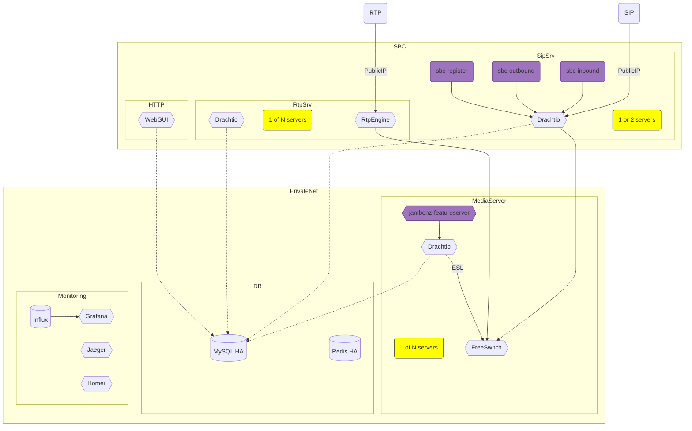

# General schema

```mermaid


graph TD;

    classDef note fill:yellow,stroke:#000,stroke-width:1px;
    classDef app fill:#9E74BE,stroke:#4E1C74,stroke-width:1px;


  I1(SIP):::topic --->|PublicIP| dr1;
  I2(RTP):::topic --->|PublicIP| re;
 

    subgraph SBC 

   subgraph SipSrv 
    n1("1 or 2 servers"):::note;
    dr1{{Drachtio}}:::server  ;
    da1(sbc-inbound):::app --> dr1;
    da2(sbc-outbound):::app --> dr1;
    da3(sbc-register):::app --> dr1;

   end 

   subgraph RtpSrv 
    n2("1 of N servers"):::note;
    dr2{{Drachtio}}:::server ;
    re{{RtpEngine}}:::server ;
   end 

    subgraph HTTP 
    GUI{{WebGUI}}:::server;

    end


    end

    subgraph PrivateNet

    subgraph MediaServer
    n3("1 of N servers"):::note;
    
   dr1 -----> fs;
   re --> fs;

    dr3{{Drachtio}}:::server ;
    da4{{jambonz-featureserver}}:::app --> dr3;
    fs{{FreeSwitch}}:::server;
    dr3 -->|ESL| fs;
    end

    subgraph DB
            
        MY[("MySQL HA")]:::server;
        RD[("Redis HA")]:::server;
    end

    dr1 -.-> MY; 
    dr2 -.-> MY; 
    dr3 -.-> MY; 
    GUI -.-> MY;

    subgraph Monitoring

    

GRF{{Grafana}}:::server;
INF[("Influx")]:::server;
JGR{{Jaeger}}:::server;
HMR{{Homer}}:::server;

    INF --> GRF;

    end
    end


```
